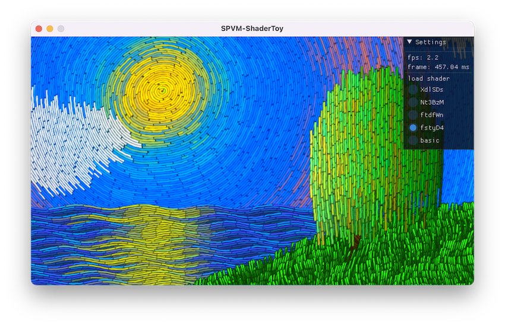
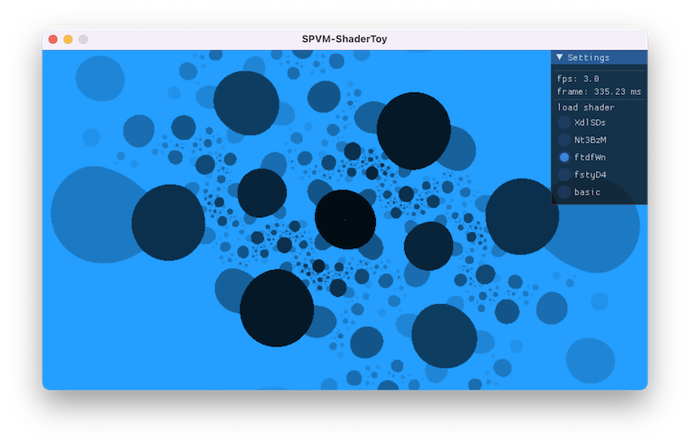
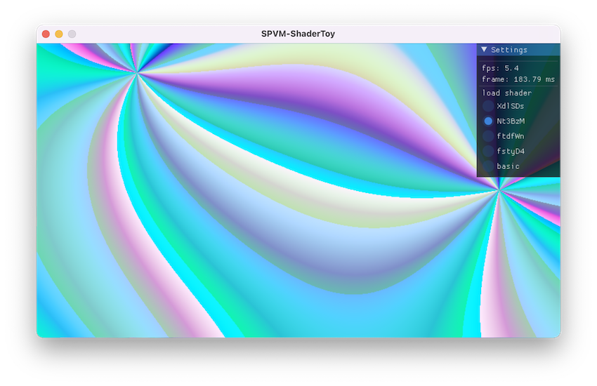
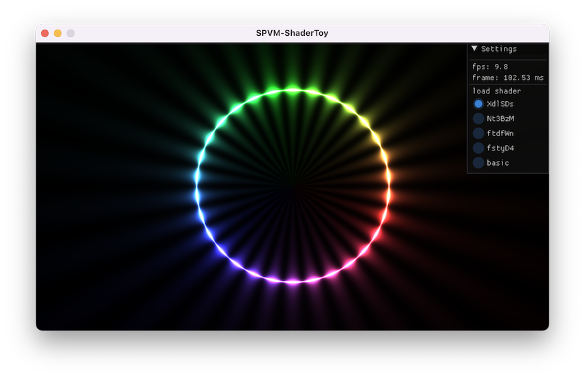

# SPVM
Tiny C++ [SPIR-V](https://registry.khronos.org/SPIR-V/) virtual machine (interpreter), you can use it to debug shaders: first compile your shader code(GLSL/HLSL) to SPIR-V binary file (using tools such as [glslangValidator](https://github.com/KhronosGroup/glslang)), then decode and execute entry point function `main` with SPVM, and check the output.

[](./LICENSE)
[](https://github.com/keith2018/spvm/actions/workflows/cmake_linux.yml)
[](https://github.com/keith2018/spvm/actions/workflows/cmake_macos.yml)
[](https://github.com/keith2018/spvm/actions/workflows/cmake_windows.yml)

Specifications that the project follows is:
- [SPIR-V 1.0](https://registry.khronos.org/SPIR-V/specs/1.0/SPIRV.html)
- [GLSL.std.450](https://registry.khronos.org/SPIR-V/specs/1.0/GLSL.std.450.html)

### Limits
- Only part of SPIR-V 1.0 instructions has been implemented right now, see the opcodes support status:
  - [Core (SPIR-V 1.0) Opcodes](OPCODE_CORE.md)
  - [Ext (GLSL.std.450) Opcodes](OPCODE_EXT.md)
- Only support 32-bits width [Numerical type](https://registry.khronos.org/SPIR-V/specs/1.0/SPIRV.html#_types) (float, integer)
- Only support [Addressing Model](https://registry.khronos.org/SPIR-V/specs/1.0/SPIRV.html#Addressing_Model) `Logical`
- Not support OpenCL related instructions

The project is still working in progress ...

## Spvm-ShaderToy
Spvm-ShaderToy simulated the runtime environment of [shadertoy](https://www.shadertoy.com/), and execute shader code using SPVM (may very slow 😀).

### Gallery

<p float="left">
  
  
</p>

<p float="left">
  
  
</p>

## Example

GLSL fragment shader (see [example/shaders/simple.frag](example/shaders/simple.frag))

```glsl
#version 450

layout (location = 0) in vec3 inColor;
layout (location = 0) out vec4 outFragColor;

void main()
{
    outFragColor = vec4(inColor.yxz, 1.0f);
}
```

run with spvm (see [example/main.cpp](example/main.cpp))

```cpp
#define HEAP_SIZE 128 * 1024
const char *SPV_PATH = "shaders/simple.frag.spv";

SPVM::SpvmModule module;
SPVM::Runtime runtime;

// decode spir-v file
bool success = SPVM::Decoder::decodeFile(SPV_PATH, &module);
if (!success) {
  std::cout << "error decode spir-v file";
  return -1;
}

// init runtime
success = runtime.initWithModule(&module, HEAP_SIZE);
if (!success) {
  std::cout << "error init module";
  return -1;
}

// get uniform locations
SPVM::SpvmWord inColorLoc = runtime.getLocationByName("inColor");
SPVM::SpvmWord outFragColorLoc = runtime.getLocationByName("outFragColor");

// write input
float inColor[3]{0.2f, 0.3f, 0.4f};
runtime.writeInput(inColor, inColorLoc);

// execute shader entry function 'main'
success = runtime.execEntryPoint();
if (!success) {
  std::cout << "error exec entrypoint function";
  return -1;
}

// read output
float outFragColor[4];
runtime.readOutput(outFragColor, outFragColorLoc);

std::cout << "outFragColor[0]: " << outFragColor[0] << std::endl;
std::cout << "outFragColor[1]: " << outFragColor[1] << std::endl;
std::cout << "outFragColor[2]: " << outFragColor[2] << std::endl;
std::cout << "outFragColor[3]: " << outFragColor[3] << std::endl;
```

## Clone
```bash
git clone git@github.com:keith2018/spvm.git
cd spvm
git submodule update --init --recursive
```

## Build
```bash
mkdir build
cmake -B ./build -DCMAKE_BUILD_TYPE=Release
cmake --build ./build --config Release
```

## Test
```bash
cd build
ctest
```

## License
This code is licensed under the MIT License (see [LICENSE](LICENSE)).
